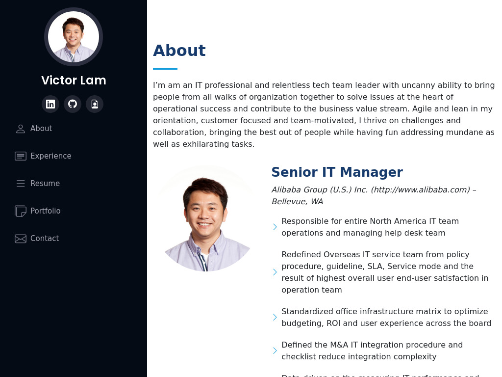

# My Portfolio Page
##Author: Victor Lam

Github Repository: https://github.com/mingmanhk/MyPortfolioPage\
Page: https://mingmanhk.github.io/MyPortfolioPage/ 

## Purpose: 
Create a professional portfolio page along with github project, linkedin and resume
## Features

- Import a HTML file and watch it magically convert to Markdown
- Drag and drop images (requires your Dropbox account be linked)
- Import and save files from GitHub, Dropbox, Google Drive and One Drive
- Drag and drop markdown and HTML files into Dillinger
- Export documents as Markdown, HTML and PDF

Updated portfolio featuring Project 1 and two exemplary homework assignments.-Done
1. Display your contact information. If you don't want to share your personal email or phone number, use a separate email that you will only use for coding, also known as a developer email, and/or a call forwarding service, such as Google Voice. - Done
2. Have links to your GitHub profile and LinkedIn profile - Done
3. Have a link to a downloadable PDF of your resume - Done
4. Display at least 2 examples of student work from either deployed projects or homeworks. For each project, make sure you have the following - Done
    - Project title
    - Link to the deployed version
    - Link to the GitHub repository
    - Screenshot of the deployed application
        5. Have a polished, mobile-responsive user interface. -Done
    - Mobile-first design-Done
    - Choose a color palette for your site so it doesn't just look like the default bootstrap theme or an unstyled HTML site.-Done
    - Make sure the font size is large enough to read, and that the colors don't cause eye strain.-Done
Updated GitHub profile with pinned repositories featuring Project 1 and two exemplary assignments.-Done
    1. Profile picture or avatar
    2. A photo or an avatar other than the default Github identicon. (a semi-professional to professional photo or an avatar photo are preferred)
Biography
    3. Email address. If you don't want to share your personal email or phone number, use a developer email.-Done
    4. Link to your deployed portfolio-Done
    5. At least 2 pinned repositories:-Done
    6. Follow a few of your classmates and/or other developers. They are the beginning of your professional network and being a developer is as much about being a part of the community as it is writing code.-Done
    7. README files. Every pinned project should contain a README file with:-Done
    8. Commit history. Every pinned repository should have at least 20 commits.-Done
Updated resume-Done
Updated LinkedIn profile-Done

## Page

Copyright 2021 Victor Lam